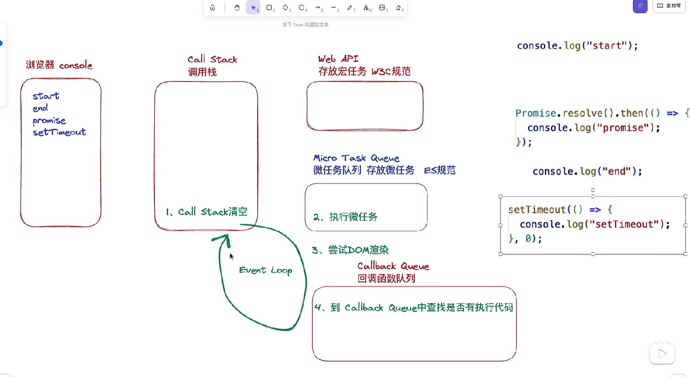

# 第 1 题：事件循环机制

js分为同步代码和异步代码。执行js的时候，会从上往下执行。遇到同步代码时候，会执行当前同步代码，然后继续向下执行，遇到异步代码的时候，会将该异步代码放到异步队列中，继续向下执行，直到所有的同步任务都执行完毕。从异步队列中取任务继续执行。


## 基本概念

 * 调用栈：执行JS代码的。会记录函数调用的过程，并将函数的变量等信息以栈帧的形式压入，当执行完函数后，将栈顶的帧弹出。

 * 堆：用来存储对象变量或者其他复杂的数据结构变量

 * 任务队列：存储待执行的任务：eg. 点击事件、回调函数等。任务又包括 宏任务和微任务。


## 宏任务与微任务
  * 微任务：Promise、Async/Await、MutationObserver
  * 宏任务：Ajax、setTimeout、setInterval、script 整体代码、UI render


## Event Loop 过程
  * 同步代码，一行一行放在 Call Stack（调用栈） 中执行
  * 遏到异步，会先“记录”下，等待执行时机(selTimeuul.Ajax)。时机到了，将之前“记录”的化码放入Callback Queue(回调函数队列）
  * 当 Call Stack 为空 (同步代码执行完)，Event Loop 开始工作
  * Event Locp 轮询查找 Calback Queue 中是否有可执行的码。如果有，将代码移动到 Call Stack 中执行
  * Event Loop 如果没有找到可以执行代码，则会继续轮询查找

*****

  * 首先 script 整体作为宏任务执行，执行同步代码，当遇到异步任务时，如果是宏任务就会交给其他线程处理，并放入对应的任务队列中。微任务放入微任务队列，主线程挂起这些异步任务，接着执行后面的代码
  * 当前执行栈清空会先执行所有的微任务，如果还遇到微任务也会将其放入当前微任务队列后，直到所有执行完。
  * 然后主线程根据调度优先级从宏任务队列中适合执行的任务执行，然后不断重复以上操作。


## 总结

EventLoop 就是通过事件循环的机制，当执行栈空闲时，主线程判断任务队列是否有合适的任务，取出最老的一个任务将其压入调用栈中执行，执行完后再次出栈，如此反复不断循环，就是所谓的事件循环机制





## 代码阅读

```
console.log(1)

setTimeout(function() {
  console.log(2)
})

new Promise(function (resolve) {
  console.log(3)
  resolve()
 }).then(function () {
  console.log(4)
}).then(function() {
  console.log(5)
})

console.log(6)

// 1 3 6 4 5 2

```

```
setTimeout(()=>{
  console.log(0) 
},0)
new Promise((resolve)=>{
  console.log(1)
  resolve()
}).then(()=>{
  console.log(2) 
}).then(()=>{
  console.log(3) 
})
console.log(4) 


// 1 4 2 3 0

```

```
new Promise((resolve,reject)=>{
  console.log("p1-0")
  resolve()
}).then(()=>{
  console.log("p1-1")
  new Promise((resolve,reject)=>{
    console.log("p2-0")
    resolve()
  }).then(()=>{
    console.log("p2-1")
  }).then(()=>{
    console.log("p2-2")
  })
}).then(()=>{
  console.log("p1-2")
})

// p1-0 p1-1 p2-0 p2-1 p1-2 p2-2
```

```
new Promise((resolve, reject) => {
  console.log("p1-0")
  resolve()
}).then(() => {
  setTimeout(() => {
    console.log('macrotask-1')
    new Promise((resolve, reject) => {
      console.log("p2-0")
      resolve()
    }).then(() => {
      setTimeout(() => {
        console.log('macrotask-2')
      }, 0)
      console.log("p2-1")
    }).then(() => {
      console.log("p2-2")
    })
  }, 0)
  console.log("p1-1")

}).then(() => {
  console.log("p1-2")
})

// p1-0、p1-1、p1-2、macrotask-1、p2-0、p2-1、p2-2、macrotask-2

```

```
async function async1() {
  console.log("a1-0");
  await async2();
  console.log("a1-1");
  setTimeout(() => {
    console.log('macro-2')
  }, 0)
}
async function async2() {
  console.log("a2-0");
  setTimeout(() => {
    console.log('macro-3')
  }, 0)
}

setTimeout(() => {
  console.log('macro-1')
}, 0)
async1();

// a1-0、a2-0、a1-1、macro-1、macro-3、macro-2
```

* Promise 构造函数中函数体的代码都是立即执行的

[Promise题库](https://juejin.cn/post/6844904077537574919?searchId=20230927095310F49DA960ABBD93AB11AB#heading-2)
