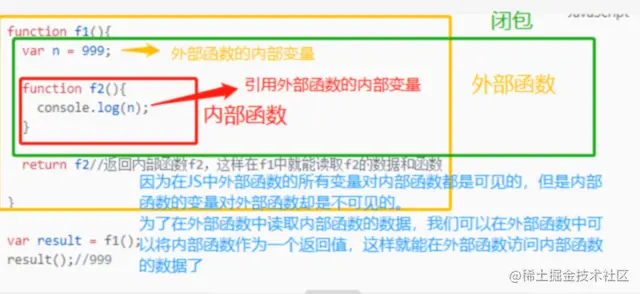

# 第 3 题：闭包

一个函数和对其周围状态（lexical environment，词法环境）的引用捆绑在一起（或者说函数被引用包围），这样的组合就是闭包（closure）。也就是说，闭包让你可以在一个内层函数中访问到其外层函数的作用域。在 JavaScript 中，每当创建一个函数，闭包就会在函数创建的同时被创建出来


## 理解闭包
```
function f1(){
  var n = 999;
  
  function f2(){
    console.log(n);
  }
  
  return f2 
  //返回内部函数f2，这样在f1中就能读取f2的数据和函数等价于window.f2 = f2;
  
}

var result = f1();
result(); //999

```



f1是一个外部函数，变量n是外部函数的局部变量，f2是嵌套在f1中的一个内部函数，在内部函数f2中调用了外部函数f1的变量n,所以f2和变量n就组成了一个闭包。

那么，我们就可以得出产生闭包的条件：

* 一个外部函数里面嵌套着一个内部函数；比如外部函数f1里面嵌套了一个内部函数f2
* 一个嵌套的内部函数调用了外部函数的内部变量或函数；比如f2内部函数调用了外部函数f1的变量n
只要满足以上两个条件，就产生了闭包。

那你可能会问为什么要return f1呢？
* 因为在JS中，只要内部函数才能够读取外部函数的内部变量或数据，反之则不行，如果你不return f2，那你将无法使用f2这个闭包，return f2是为了在f1中能使用f2的变量和数据，与闭包没有关系的。

那到底什么是闭包呢？
* 可以通俗理解成：闭包就是有权访问另一个函数作用域中内部变量或数据的函数，因为在JS中，只要内部函数能能够读取外部函数的变量或数据，反之就不行，所有可以将闭包简单理解成，定义在一个函数内部的函数。

总结：
* 闭包就是有权访问另一个函数内部变量的函数。

闭包产生的原因：
* 内部函数存在对外部函数局部变量的引用就会导致闭包。


## 使用场景

* 读取内部函数的变量

```
function f1(){
  var n = 999;
  function f2(){
    console.log(n);
  }
  return f2；
}

var result = f1();
result();//999

```

* 函数作为参数

```
var n = 999;

function f1(){
  var n = 1000;
  function f2(){
    console.log(n);
  }
  return f2
}

function f3(p){
  var n = 1001;
  p();
}

f3(f1());//1000

```
* IIFE(自执行函数)
```
var n = 999;
(function f1(){
  console.log(n);
})()
//999

```

* 循环赋值

```
for(var i = 0; i<10; i++){
  (function(j){
    setTimeout(function(){
      console.log(j);
    },1000)
  })(i)
}
//0,1,2,3,4,5,6,7,8,9依次打印

```

* 节流防抖

第一次点击的时候，我们会let一个time一个定时器，如果不采用闭包的话，下次触发函数会重新创建一个新的定时器，两个定时器的引用不同，是没有关联的，使用闭包可以直接在内存中找到之前创建的计时器，调用就可以直接拿到对应的定时器的时间


## 为什么需要闭包

因为全局变量容易污染环境，而局部变量又无法长期驻留内存，于是我们就需要一种机制，既能长期保存变量又不污染全局，这就是闭包。


## 注意点

因为使用闭包会包含其他函数的作用域，会比其他函数占据更多的内存空间，不会在调用结束之后被垃圾回收机制（简称GC机制）回收，多度使用闭包会过度占用内存，造成内存泄漏。


## 总结

* 闭包是有权访问另一个函数作用域变量的函数
* 闭包一般是函数嵌套，一个函数返回另外一个函数，内部函数访问外部函数的变量就形成了一个闭包
* 闭包的优点是可以私有化变量，将变量私有化到函数内部，并在私有化的基础上进行数据保持
* 闭包在防抖节流函数柯里化，都应用里数据保持这个特性
* 闭包的缺点是容易造成内存泄露，因为闭包创建的变量会一直存在内存中，需要及时置空，否则会造成内存泄露，影响程序性能