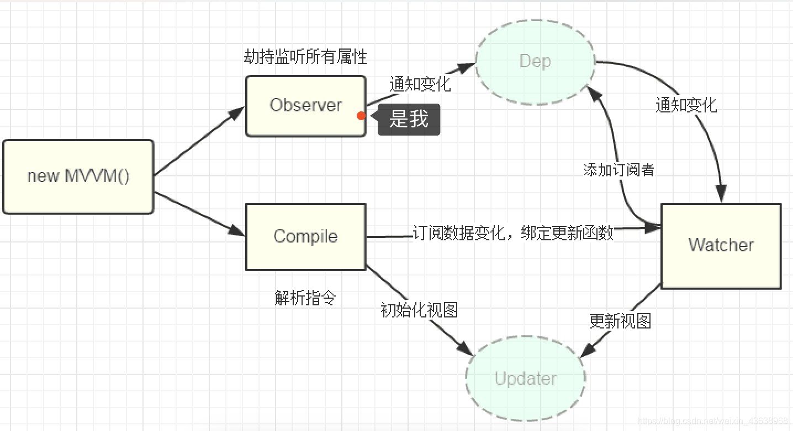

# 第 4 题：双向绑定原理

vue为MVVM框架，当数据模型data变化时，页面视图会得到响应更新，其原理对 data 的 getter/setter 方法进行拦截（Object.defineProperty 或者 Proxy）,利用发布订阅的设计模式，在getter方法中进行订阅，在setter方法中发布通知，让所有订阅者完成响应

### vue2

基于 Object.defineProperty() 重新定义 get 和 set 方法实现的。修改触发  set 方法赋值，获取或触发 get 方法取值，并通过数据劫持发布信息。

vue.js是采用数据劫持结合发布者-订阅者模式的方式，通过Object.defineProperty()来劫持各个属性的setter，getter，在数据变动时发布消息给订阅者，触发相应的监听回调来渲染视图。

*  需要observer(观察者)对数据对象进行递归遍历，包括子属性对象的属性，都加上 setter和getter
这样的话，给这个对象的某个值赋值，就会触发setter，那么就能监听到了数据变化

* compile(模板解析器)解析模板指令，将模板中的变量替换成数据，然后初始化渲染页面视图，并将每个指令对应的节点绑定更新函数，添加监听数据的订阅者，一旦数据有变动，收到通知，更新视图

* Watcher(订阅者)是Observer和Compile之间通信的桥梁，主要做的事情是:
1、在自身实例化时往属性订阅器(dep)里面添加自己
2、自身必须有一个update()方法
3、待属性变动dep.notice()通知时，能调用自身的update()方法，并触发Compile中绑定的回调，则功成身退。

* MVVM作为数据绑定的入口，整合Observer、Compile和Watcher三者，通过Observer来监听自己的model数据变化，通过Compile来解析编译模板指令，最终利用Watcher搭起Observer和Compile之间的通信桥梁，达到数据变化 -> 视图更新；视图交互变化(input) -> 数据model变更的双向绑定效果



### vue3

3.x的与2.x的核心思想一致，只不过数据的劫持使用Proxy而不是Object.defineProperty，只不过Proxy相比Object.defineProperty在处理数组和新增属性的响应式处理上更加方便

### 问题：为什么用Proxy 代替 defineProperty ？

#### Object.defineProperty

Object.defineProperty() 方法会直接在一个对象上定义一个新属性，或者修改一个对象的现有属性，并返回此对象

##### 为什么能够实现响应式？

通过 defineProperty 两个属性 get 与 set

* get

> 属性的 getter函数，当访问该属性时，会调用此函数。执行时不传入任何参数，但是会传入 this 对象。返回值会被用作属性的值

* set

> 属性的 set 函数，当属性值被修改时，会调用此函数，接受一个参数（被赋予的新值），会传入赋值的this对象，默认为 undefined

```
function update() {
    app.innerText = obj.foo
}

function defineReactive(obj, key, val) {
  Object.defineProperty(obj, key, {
    get() {
      console.log(`get ${key}:${val}`);
      return val
    },
    set(newVal) {
      if (newVal !== val) {
        val = newVal
        update()
      }
    }
  })
}

// 调用defineReactive，数据发生变化触发update方法，实现数据响应式
const obj = {}
defineReactive(obj, 'foo', '')
setTimeout(()=>{
  obj.foo = new Date().toLocaleTimeString()
},1000)

```

##### 缺点

* 检测不到对象属性的添加和删除
* 数组API无法监听到
* 需要对每个属性进行监听，若嵌套对象，需要深层监听，造成性能问题


#### Proxy

Proxy的监听是针对一个对象的，那么对这个对象的所有操作会进入监听操作，这就完全可以代理所有属性了

```
function reactive(obj) {
  if (typeof obj !== 'object' && obj != null) {
    return obj
  }
  // Proxy相当于在对象外层加拦截
  const observed = new Proxy(obj, {
    get(target, key, receiver) {
      const res = Reflect.get(target, key, receiver)
      console.log(`获取${key}:${res}`)
      return res
    },
    set(target, key, value, receiver) {
      const res = Reflect.set(target, key, value, receiver)
      console.log(`设置${key}:${value}`)
      return res
    },
    deleteProperty(target, key) {
      const res = Reflect.deleteProperty(target, key)
      console.log(`删除${key}:${res}`)
      return res
    }
  })
  return observed
}

```

#### 总结

* Object.defineProperty 只能遍历对象属性进行劫持

* Proxy 可以劫持整个对象，并返回一个新对象

* Proxy 可以直接监听数组的变化

