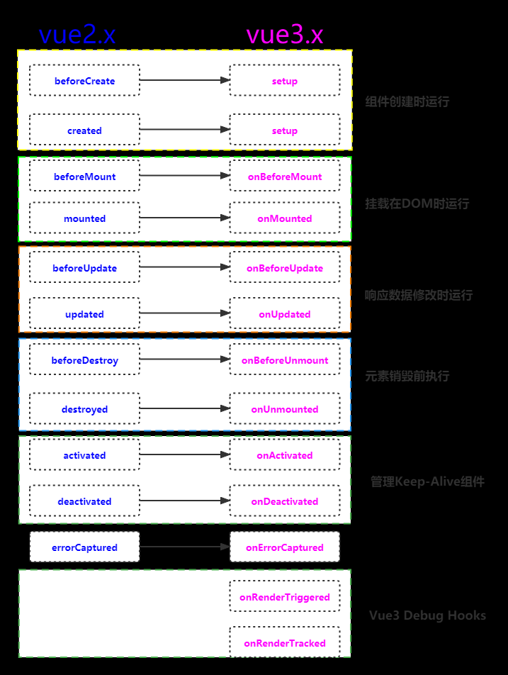

# 第 5 题：生命周期

生命周期就是组件或者实例，从创建到被销毁（初始化数据、编译模板、挂载DOM、渲染-更新-渲染）的过程。

## Vue2生命周期阶段

* 第一阶段（创建阶段）：beforeCreate、created
* 第二阶段（挂载阶段）：beforeMount(render)、mounted
* 第三阶段（更新阶段）：beforeUpdate、updated
* 第四阶段（销毁阶段）：beforeDestory、destroyed

## 生命周期钩子函数

#### beforeCreate

> 在实例初始化之后，进行数据侦听和事件/侦听器的配置之前同步调用

**在这个阶段，数据获取不到，真实dom元素也是没有渲染出来的**

#### created

> 在实例创建完成后被立即同步调用。在这一步中，实例已完成对选项的处理，意味着以下内容已被配置完毕：数据侦听、计算属性、方法、事件/侦听器的回调函数。然而，挂载阶段还没开始，且 $el property 目前尚不可用

**在这个阶段，可以访问到数据了，但是页面当中真实dom节点还是没有渲染出来，在这个钩子函数里面，可以进行相关初始化事件的绑定、发送请求操作**

#### beforeMount

> 在挂载开始之前被调用：相关的 render 函数首次被调用。

**代表dom马上就要被渲染出来了，但是却还没有真正的渲染出来，这个钩子函数与created钩子函数用法基本一致，可以进行相关初始化事件的绑定、发送ajax操作**

#### mounted

> 实例被挂载后调用，这时 el 被新创建的 vm.$el 替换了。如果根实例挂载到了一个文档内的元素上，当 mounted 被调用时 vm.$el 也在文档内。

**挂载阶段的最后一个钩子函数,数据挂载完毕，真实dom元素也已经渲染完成了,这个钩子函数内部可以做一些实例化相关的操作**

#### beforeUpdate

> 在数据发生改变后，DOM 被更新之前被调用。这里适合在现有 DOM 将要被更新之前访问它，比如移除手动添加的事件监听器。

**这个钩子函数初始化的不会执行,当组件挂载完毕的时候，并且当数据改变的时候，才会立马执行,这个钩子函数获取dom的内容是更新之前的内容**

#### updated

> 在数据更改导致的虚拟 DOM 重新渲染和更新完毕之后被调用。

**这个钩子函数获取dom的内容是更新之后的内容生成新的虚拟dom，新的虚拟dom与之前的虚拟dom进行比对，差异之后，就会进行真实dom渲染。在updated钩子函数里面就可以获取到因diff算法比较差异得出来的真实dom渲染了。**

#### beforeDestroy

> 实例销毁之前调用。在这一步，实例仍然完全可用。

**当组件销毁的时候，就会触发这个钩子函数代表销毁之前，可以做一些善后操作,可以清除一些初始化事件、定时器相关的东西**

#### destroyed

> 实例销毁后调用。该钩子被调用后，对应 Vue 实例的所有指令都被解绑，所有的事件监听器被移除，所有的子实例也都被销毁。

**Vue实例失去活性，完全丧失功能**


## vue3生命周期



## 父子生命周期

#### 加载渲染过程

```
父beforeCreate->父created->父beforeMount->子beforeCreate->子created->子beforeMount->子mounted->父mounted
```

#### 更新过程

```
父beforeUpdate->子beforeUpdate->子updated->父updated
```

#### 销毁过程

```
父beforeDestroy->子beforeDestroy->子destroyed->父destroyed
```

