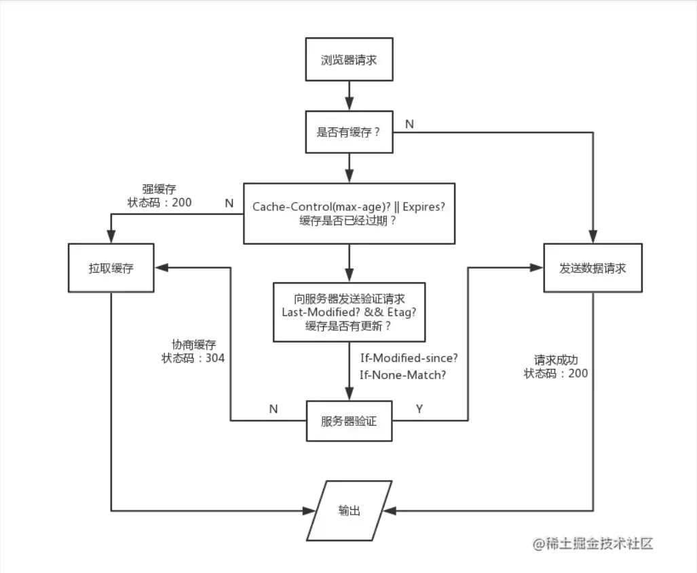

# 第 9 题：浏览器缓存策略

浏览器缓存过程如下：

* 开始加载，域名解析，DNS缓存
* 本地缓存（memory缓存）
* Http缓存（强缓存和协商缓存）
* 服务端缓存（cdn缓存）

## DNS 缓存

>通常我们输入一个网址，它包含了域名和端口可以指定唯一的IP地址，然后建立连接进行通信，而域名查找IP地址的过程就是dns解析

> 这个过程会对网络请求带来一定的损耗，所以浏览器在第一次获取到IP地址后，会将其缓存起来。下次相同域名再次发起请求时，浏览器会先查找本地缓存，如果缓存有效，则会直接返回该IP地址，否则会继续开始寻址之旅

* 首先搜索浏览器自身的DNS缓存,如果存在，则域名解析到此完成。
* 如果浏览器自身的缓存里面没有找到对应的条目，那么会尝试读取操作系统的hosts文件看是否存在对应的映射关系,如果存在，则域名解析到此完成。
* 如果本地hosts文件不存在映射关系，则查找本地DNS服务器(ISP服务器,或者自己手动设置的DNS服务器),如果存在,域名到此解析完成。
* 如果本地DNS服务器还没找到的话,它就会向根服务器发出请求,进行迭代查询


## memory chache （本地缓存）

> memory cache 是浏览器为了加快读取缓存速度而进行的自身的优化行为，不受开发者控制，也不受 HTTP 协议头的约束。当资源被存入内存后，下次同样的请求将不再通过网络，而是直接访问内存，当关闭该页面时，此资源就被内存释放掉了，再次重新打开相同页面时不再出现from memory cache的情况。

**那什么时候资源会被放入memory缓存呢**

> 答案是几乎所有的网络请求资源都会根据相关的策略被浏览器自动加入到 memory cache 中。但是也正因为数量很大但是浏览器占用的内存不能无限扩大这样两个因素，memory cache 注定只能是个“短期存储”。当数据量过大，即使网页不关闭，缓存依然会失效。
memory cache 机制保证了一个页面中如果有两个相同的请求 (例如两个 src 相同的 ``，两个 href 相同的 `<link>`)都实际只会被请求最多一次，避免浪费。


## disk cache （硬盘缓存）

> 硬盘缓存取决于HTTP中的响应头信息，它也是浏览器缓存中最重要的内容

### 强缓存

> 对于强缓存，控制它的字段分别是：Expires和Cache-Control，其中Cache-Control优先级比Expires高

```
Cache-Control: max-age=3600 我希望你把这个资源缓存起来，缓存时间是3600秒（1小时）
Expires: Thu, 10 Nov 2020 08:45:11 GMT 到达指定时间过期
Date: Thu, 30 Apr 2020 12:39:56 GMT
Etag:W/"121-171ca289ebf"，(后面协商缓存内容)这个资源的编号是W/"121-171ca289ebf"
Last-Modified:Thu, 30 Apr 2020 08:16:31 GMT，(后面协商缓存内容)这个资源的上一次修改时间
```
Cache-Control和 Expires分别是HTTP/1.1 和 HTTP/1.0的内容，为了兼容 HTTP/1.0 和 HTTP/1.1，实际项目中两个字段我们都会设置。


**浏览器收到这个响应之后就会做下面的事情**

* 浏览器把这次请求得到的响应体缓存到本地文件中
* 浏览器标记这次请求的请求方法和请求路径
* 浏览器标记这次缓存的时间是3600秒
* 浏览器记录服务器的响应时间是格林威治时间2020-04-30 12:39:56

这一次的记录非常重要，它为以后浏览器要不要去请求服务器提供了依据。

之后当客户端收准备再次请求同样的地址时，它突然想起了一件事：我需要的东西在不在缓存里呢？

此时，客户端会到缓存中去寻找是否有缓存的资源，判断缓存是否有效就是通过把max-age + Date，得到一个过期时间，看看这个过期时间是否大于当前时间，如果是，则表示缓存还没有过期，仍然有效，如果不是，则表示缓存失效。

### 协商缓存

> 一旦发现缓存无效，它并不会简单的把缓存删除，而是抱着一丝希望，想问问服务器，我这个缓存还能继续使用吗？于是，浏览器向服务器发出了一个带缓存的请求

所谓带缓存的请求，无非就是加入了以下的请求头：

```
If-Modified-Since: Thu, 30 Apr 2020 08:16:31 GMT  亲，你曾经告诉我，这个资源的上一次修改时间是格林威治时间2020-04-30 08:16:31，请问这个资源在这个时间之后有发生变动吗？
If-None-Match: W/"121-171ca289ebf"  亲，你曾经告诉我，这个资源的编号是W/"121-171ca289ebf，请问这个资源的编号发生变动了吗？
```

之所以要发两个信息，是为了兼容不同的服务器，因为有些服务器只认If-Modified-Since，有些服务器只认If-None-Match，有些服务器两个都认,但是一般来说 If-None-Match 的优先级高于 If-Modified-Since

**此时可能会产生两个结果**

**缓存失效:** 那么非常简单，服务器再次给予一个正常的响应（响应码200 带响应体），同时可以附带上新的缓存指令，浏览器缓存新的内容
**缓存有效:** 服务器返回304重定向，并且响应头带上新的缓存指令，浏览器作出相应缓存动作。

## 补充（关键字段值）

### Cache-Control

是服务器向客户端响应的一个消息头，它提供了一个max-age用于指定缓存时间。实际上，Cache-Control还可以设置下面一个或多个值：

* public：指示服务器资源是公开的

* private：指示服务器资源是私有的

* no-cache：告知客户端，你可以缓存这个资源，但是不要直接使用它。当你缓存之后，后续的每一次请求都需要附带缓存指令，让服务器告诉你这个资源有没有过期

* no-store：告知客户端，不要对这个资源做任何的缓存，之后的每一次请求都按照正常的普通请求进行。若设置了这个值，浏览器将不会对该资源做出任何的缓存处理。

* max-age：指定缓存时间

```
// 这是一个公开资源，请缓存1个小时。
Cache-Control: public, max-age=3600 
```

### Expire

在http1.0版本中，是通过Expire响应头来指定过期时间点的，例如：

```
Expire: Thu, 30 Apr 2020 23:38:38 GMT
```
到了http1.1版本，已更改为通过Cache-Control的max-age来记录了。


### 协商缓存的流程

**第一次请求**
客户端发送请求，服务器处理请求，返回文件内容和一堆Header，包括Etag 和 Last-Modified，状态码200

**第二次请求**
1、客户端发起请求，此时请求头上会带上 if-none-match 值为 Etag 和 if-modified-since 值为last-modified
2、服务器优先判断 Etag，若资源未变化状态码为304，客户端继续使用本地缓存，若资源发生变化，状态码为200 并返回最新的资源


## 总结

当浏览器再次访问一个已经访问过的资源时，它会这样做：

1.根据相关字段判断是否命中强缓存，如果命中，就直接使用缓存了。
2.如果没有命中强缓存，就发请求到服务器检查是否命中协商缓存。
3.如果命中协商缓存，服务器会返回 304 告诉浏览器使用本地缓存。
4.否则，返回最新的资源



[如何判断缓存过期，是否依赖本地时间](https://segmentfault.com/a/1190000044332130)